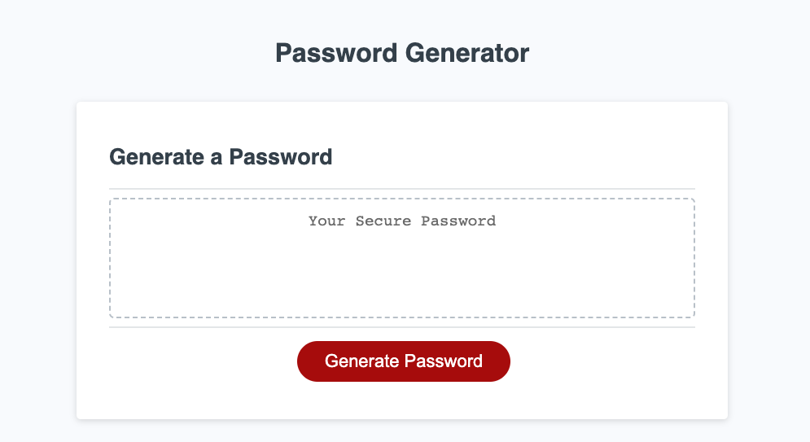

# <Password Generator>

## Description

This is a password generator application that enables employees to generate random passwords based on specific criteria they select. The application runs in the browser and features a clean and polished user interface that adapts to different screen sizes.

## Installation

There is no installation required for this password generator. You can simply access it by opening the index.html file in a web browser.

## Usage

To use the password generator:

Click the "Generate Password" button.
You will be presented with a series of prompts to select the desired criteria for the password.
Choose the password length between 8 and 128 characters.
Confirm whether you want to include lowercase, uppercase, numeric, and/or special characters.
Once you answer all the prompts, a password will be generated that matches your selected criteria.
The generated password will either be displayed in an alert or written directly on the page.

Deployment Link:
https://rachelcodes42.github.io/password-generator/ 

## Credits

The password generator application was developed as part of a challenge, using starter code provided.

## License

This project is licensed under the MIT License.

## Badges

## Features

HTML
CSS
JavaScript

## How to Contribute

Contributions are welcome! If you would like to contribute to this project, please follow these steps:

Fork the repository.
Create a new branch for your contribution.
Make your enhancements or bug fixes.
Commit your changes and push your branch to your forked repository.
Submit a pull request detailing the changes you made.